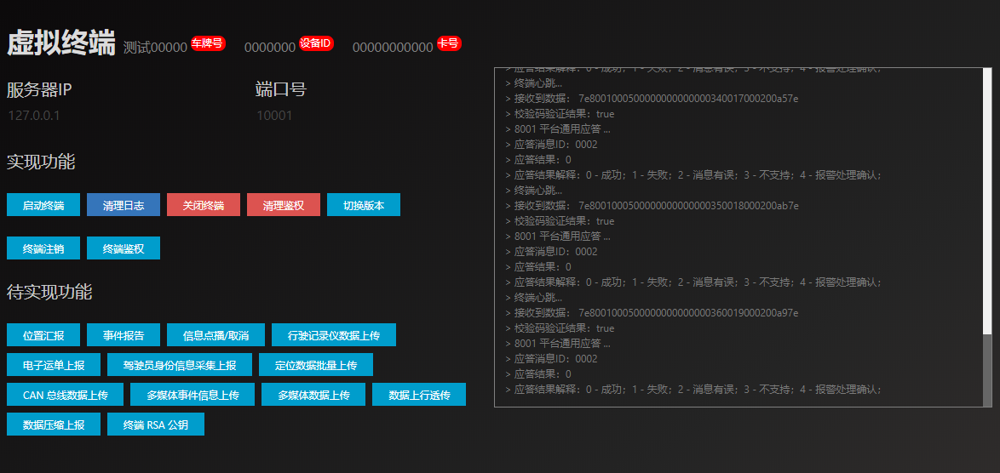

# 中国交通标准808协议 虚拟终端



## 介绍

本终端主要用于测试，基于 [spring-boot-starter-jt808](https://github.com/zhoyq/spring-boot-starter-jt808) 开发的 [jt808-server](https://github.com/iov-pro/jt808-server) 服务。

## 版本特性

### 预发布版本 v0.0.x

- 依次实现终端的注册、注销、鉴权等基础功能
- 依次实现终端的位置汇报、事件报告、信息点播、数据上传等信息功能
- 待基础与信息功能完成 发布 v1.0.0

## 如何使用

```bash
# 克隆项目到本地
git clone https://github.com/iov-pro/jt808-client.git
# 进入工作目录
cd jt808-client
# 安装包管理工具
npm install -g tyarn yarn
# 安装依赖
tyarn
# 构建
tyarn build
# 开发
tyarn dev
```

## FAQ

暂无

## 致谢

暂无

## 授权

使用 MIT 授权
